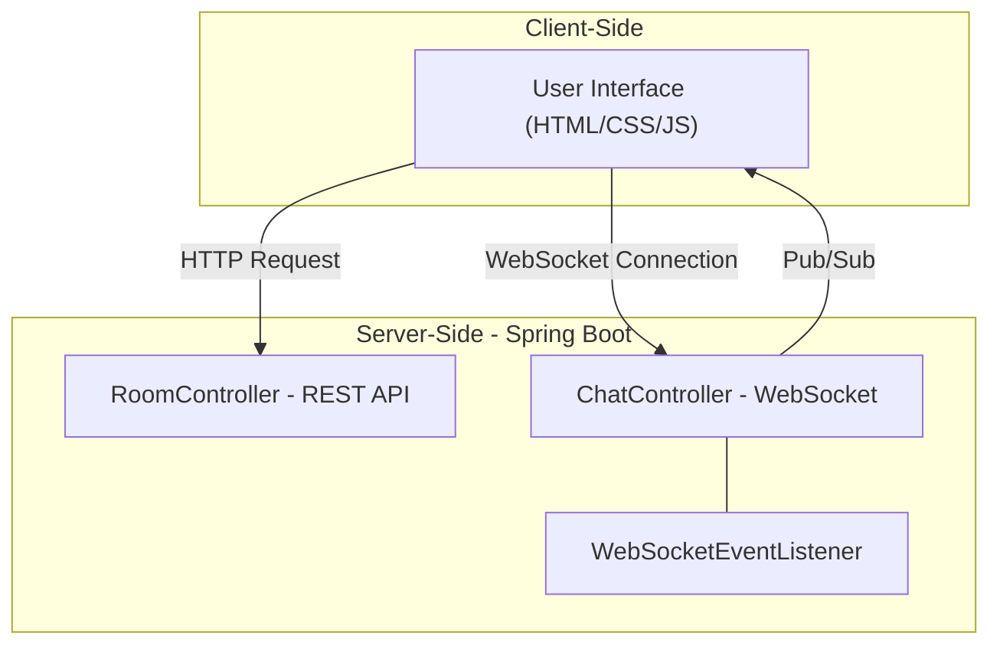
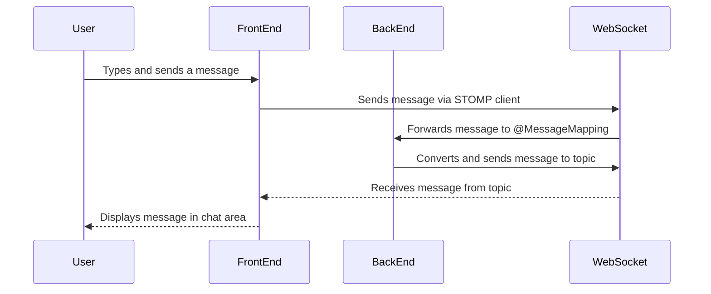
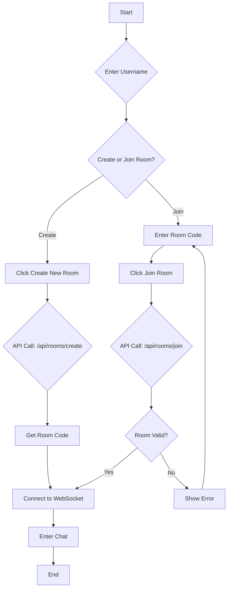
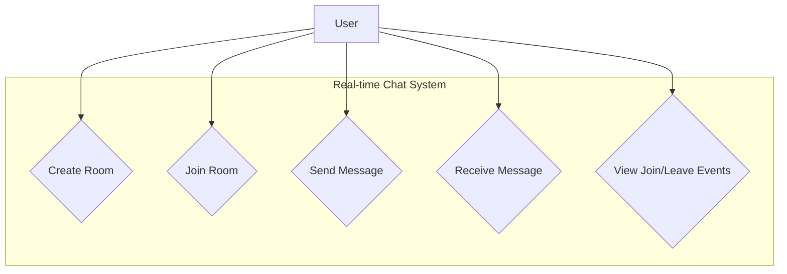

# Real-time Chat Application Documentation

## Acknowledgement

We would like to express our sincere gratitude to everyone who contributed to the successful development of this project. Your support and guidance were invaluable.

---

## Abstract

The Real-time Chat Application is a modern, web-based communication platform designed to facilitate instant messaging between users in dedicated chat rooms. Leveraging a powerful back-end built with Spring Boot and a responsive, mobile-first front-end, the application provides a seamless and interactive user experience. By utilizing WebSockets for persistent, bidirectional communication, the system ensures that messages are delivered instantly without the need for manual page refreshes. The project's primary goal is to deliver a reliable, scalable, and user-friendly chat solution that mimics the functionality and aesthetic of popular messaging applications like iMessage.

---

## Table of Contents
1. [Introduction](#1-introduction)
2. [Objectives](#2-objectives)
3. [Features](#3-features)
4. [Existing System](#4-existing-system)
5. [Hardware Requirements](#5-hardware-requirements)
6. [Software Requirements](#6-software-requirements)
7. [System Architecture](#7-system-architecture)
8. [Getting Started](#11-getting-started)
    1. [Prerequisites](#111-prerequisites)
    2. [Running the Application](#112-running-the-application)
    3. [Using the Chat](#113-using-the-chat)
9. [User Flow](#9-user-flow)
10. [Tech Stack](#10-tech-stack)
11. [Getting Started](#10-getting-started)
12. [Project Structure](#12-project-structure)
13. [Use Case Diagram](#13-use-case-diagram)
14. [Module Description](#14-module-description)
15. [Implementation](#15-implementation)
16. [Testing](#16-testing)
17. [Result](#17-result)
18. [Conclusion](#18-conclusion)

---

## 1. Introduction

This document provides a comprehensive overview of the Real-time Chat Application. This is a web-based chat application that allows users to communicate in real-time within chat rooms. The application is built with a Spring Boot back-end and a simple HTML, CSS, and JavaScript front-end. The chat functionality is powered by WebSockets, and the front-end is designed to mimic the look and feel of a modern mobile chat application like iMessage.

---

## 2. Objectives

The primary objectives for this project were:
*   To develop a fully functional real-time chat application.
*   To implement a room-based system allowing for both public and private conversations.
*   To ensure low-latency message delivery using WebSocket technology.
*   To create a responsive, mobile-first user interface that is both modern and intuitive.
*   To build a secure and scalable back-end service capable of managing multiple users and rooms.
*   To provide clear visual feedback for system events, such as users joining or leaving a room.

---

## 3. Features

*   **Real-time Messaging:** Messages are sent and received in real-time without the need to refresh the page, thanks to WebSocket integration.
*   **Chat Rooms:** Users can create new chat rooms or join existing ones using a unique room code.
*   **User-friendly Interface:** The chat interface is designed to be intuitive and responsive, resembling the iMessage application.
*   **Join/Leave Notifications:** Users are notified when other users join or leave the chat room.
*   **Mobile-First Responsive Design:** The application is designed to work seamlessly on both desktop and mobile devices.

---

## 4. Existing System

Traditional web-based chat systems often rely on less efficient methods like HTTP polling or long-polling. In such systems, the client repeatedly sends requests to the server to check for new messages. This approach introduces significant latency, as messages are not delivered instantly. It also creates unnecessary network overhead and increases the load on the server, leading to poor scalability and a disjointed user experience. These older systems often lack responsive design, making them difficult to use on mobile devices.

---

## 5. Hardware Requirements

*   **Server:**
    *   Processor: 2.0 GHz Dual-Core or better
    *   RAM: 2 GB or more
    *   Disk Space: 10 GB or more
*   **Client:**
    *   Any modern computer or mobile device with a web browser.

---

## 6. Software Requirements

*   **Server:**
    *   Operating System: Windows, macOS, or any distribution of Linux.
    *   Runtime: Java Development Kit (JDK) 21 or newer.
*   **Client:**
    *   A modern web browser with WebSocket support (e.g., Google Chrome, Mozilla Firefox, Microsoft Edge, Safari).
    *   No additional software or plugins are required.

---

## 7. System Architecture

This diagram shows the main components of the application and how they interact.



## 8. Message Flow

This sequence diagram illustrates how a message is sent from one user and received by others in the same room.



## 9. User Flow

This flowchart shows the steps a user takes from entering their username to joining a chat room.



## 10. Tech Stack

### Back-end
*   **Java 21**
*   **Spring Boot 3.2.2**
    *   `spring-boot-starter-websocket`: For WebSocket-based real-time communication.
    *   `spring-boot-starter-web`: For the RESTful API to create and join rooms.
*   **Gradle:** As the build automation tool.

### Front-end
*   **HTML5**
*   **CSS3:** For styling the application, with a focus on a responsive, iMessage-like design.
*   **JavaScript (ES6+):** For handling client-side logic, WebSocket connections, and DOM manipulation.
*   **SockJS & Stomp.js:** JavaScript libraries to enable WebSocket communication with the Spring Boot back-end.

## 11. Getting Started

### 11.1. Prerequisites

*   **Java Development Kit (JDK) 21** or later.
*   **Gradle** (or use the included Gradle wrapper).
*   A modern web browser that supports WebSockets.

### 11.2. Running the Application

1.  Clone the repository to your local machine.
2.  Open a terminal or command prompt and navigate to the project's root directory.
3.  Run the application using the Gradle wrapper:
    *   On Windows: `.\gradlew bootRun`
    *   On macOS/Linux: `./gradlew bootRun`
4.  The application will start on `http://localhost:8080`

### 11.3. Using the Chat

1.  **Enter a Username:** Open your web browser and navigate to `http://localhost:8080`. You will be prompted to enter a username.
2.  **Create or Join a Room:**
    *   **Create:** Click the "Create New Room" button to start a new chat room. You will be provided with a unique room code to share with others.
    *   **Join:** Enter an existing room code and click "Join Room" to enter a chat room.
3.  **Start Chatting:** Once in a room, you can send and receive messages in real-time.

## 12. Project Structure

```
realtime-chat/
├── .gitignore
├── build.gradle
├── gradlew
├── gradlew.bat
├── README.md
├── src/
│   └── main/
│       ├── java/
│       │   └── com/
│       │       └── example/
│       │           └── realtimechat/
│       │               ├── ChatController.java
│       │               ├── ChatMessage.java
│       │               ├── RealtimeChatApplication.java
│       │               ├── Room.java
│       │               ├── RoomController.java
│       │               ├── WebSocketConfig.java
│       │               └── WebSocketEventListener.java
│       └── resources/
│           └── static/
│               ├── index.html
│               ├── css/
│               │   └── main.css
│               └── js/
│                   └── main.js
```
---
## 13. Use Case Diagram


*   **Create Room:** A user can request the system to create a new chat room and receives a unique room code.
*   **Join Room:** A user can join an existing chat room by providing its unique code.
*   **Send Message:** A user connected to a room can send a message, which will be broadcast to all other users in the same room.
*   **Receive Message:** A user receives messages from other users in the same room in real-time.
*   **View Join/Leave Events:** A user is notified when another user joins or leaves the room.

---

## 14. Module Description

The application is primarily divided into two main modules:

*   **Back-end Module (Spring Boot Application):**
    *   `ChatController`: Handles WebSocket message mapping for sending messages and adding users to a room.
    *   `RoomController`: Provides REST endpoints for creating and joining chat rooms.
    *   `WebSocketConfig`: Configures the WebSocket message broker and endpoints.
    *   `WebSocketEventListener`: Listens for WebSocket connection events (e.g., disconnect) to manage user presence.
    *   `ChatMessage` & `Room`: Data models representing messages and chat rooms.

*   **Front-end Module (Static Resources):**
    *   `index.html`: The main HTML file containing the structure for all pages (login, room selection, chat).
    *   `main.css`: The stylesheet responsible for the application's appearance, including the responsive, iMessage-like design.
    *   `main.js`: The core JavaScript file that handles user interactions, manages the WebSocket lifecycle (connect, send, receive), and dynamically updates the DOM.

---

## 15. Implementation

The core of the real-time functionality is implemented using the STOMP (Simple Text Oriented Messaging Protocol) over WebSocket.

1.  **Connection:** The client first enters a username. Then, it can either send a POST request to `/api/rooms/create` to get a new room code or `/api/rooms/join` with an existing code.
2.  **WebSocket Handshake:** Upon successfully entering a room, the client uses SockJS and Stomp.js to connect to the `/ws` endpoint on the server, upgrading the connection to a WebSocket.
3.  **Subscribing:** The client subscribes to a room-specific topic at `/topic/public/{roomCode}`. This is the channel through which it will receive messages.
4.  **Sending Messages:** When a user sends a message, it is sent to the server destination `/app/chat.sendMessage/{roomCode}`. The `ChatController` receives this message and uses a `SimpMessageSendingOperations` template to broadcast it to all subscribers of the room's topic.
5.  **User Events:** When a user joins, a message of type `JOIN` is broadcast. When a user disconnects, the `WebSocketEventListener` catches the event and broadcasts a `LEAVE` message to the appropriate room topic.

---

## 16. Testing

*   **Manual Testing:**
    *   Tested the process of creating and joining rooms across multiple browser tabs and devices to ensure session handling was correct.
    *   Verified real-time message delivery in both directions.
    *   Confirmed that join/leave notifications appear correctly for all users in a room.
    *   Checked the responsive design on various screen sizes to ensure the layout remains consistent and usable.
*   **Back-end Testing (Future Scope):**
    *   Unit tests could be written for the `RoomController` to verify the logic of creating and joining rooms.
    *   Integration tests could be developed to test the full WebSocket message flow using Spring's testing framework.

---

## 17. Result

The project successfully resulted in a functional, real-time chat application that meets all the specified objectives. The final product features a clean, responsive, and intuitive user interface that works well on both desktop and mobile devices. The back-end is robust, handling multiple concurrent users and rooms efficiently. The use of WebSockets ensures a seamless and instant messaging experience, making it a viable platform for real-time communication.

---

## 18. Conclusion

This project demonstrates the effective use of modern web technologies like Spring Boot and WebSockets to build a high-quality, real-time application. The resulting chat platform is both functional and user-friendly. While the current version is a strong proof-of-concept, there is significant potential for future enhancements. Possible future work could include adding user authentication, message persistence (chat history), support for private one-on-one messaging, and end-to-end encryption to further improve the application's security and feature set.
